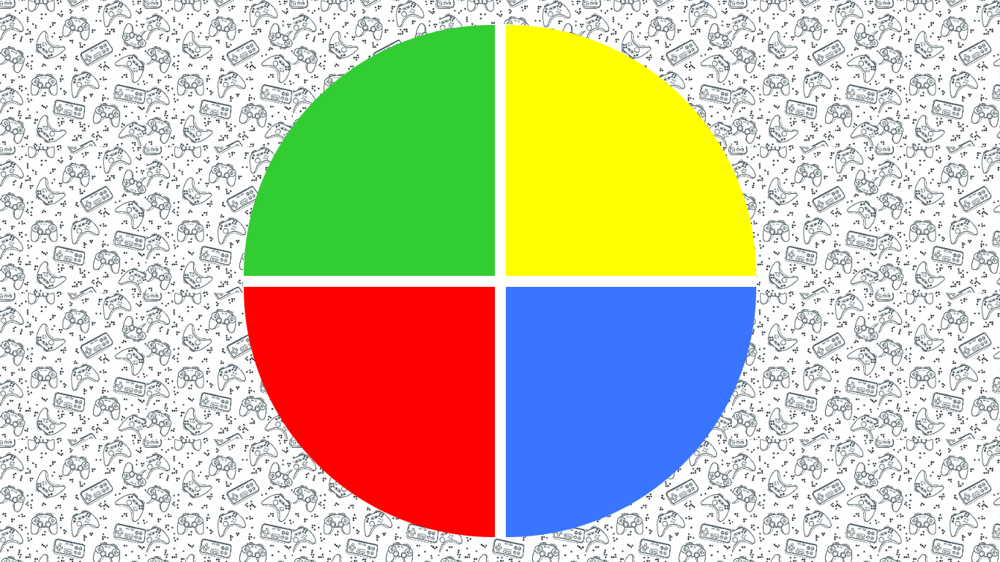

## Genius Game

 
 
## Descrição:
Projeto desenvolvido com base nas aulas da plataforma dio.me com objetivo de criar um jogo da memória estilo Genius utilizando HTML, CSS e Javascript. 
  
Principais conceitos aplicados: CSS Grid, manipulação de Array e Arrow Functions. 

